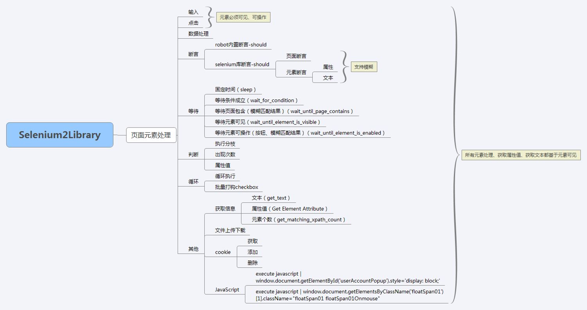

### RobotFramework使用指南
> 基于python的关键字驱动的自动化测试框架

- **RIDE工作原理**

- **Selenium2Library**

    > 提供页面相关操作：例如，文本框输入、元素点击、断言等
    

    

- **怎样利用RF设计测试用例** 
 
    - **关键字**
        1. **基础关键字**
    
            > 内置关键字：例如，BuildIn
        
            > 第三方库关键字：例如，Selenium2Library
       
        2. **用户自定义关键字**
    
            一般是由基础关键字构成的在场景设计中频繁使用的操作关键字
        
        3. **业务关键字**
    
            由基础和用户定义关键字构成的具有一定逻辑性的功能关键字
        
        4. **用例关键字**
    
            基本由业务关键字构成的测试用例关键字

    - **设计用例方法**
    
        **整体**——**提取**——**拆分**
        
        > **整体**：先从整理出发根据场景设计适用于自动化执行的用例；  
          **提取**：  
            1）从整体操作步骤中，提取**业务关键字**；  
            2）再继续根据业务关键字继续进一步提取**操作关键字**；  
          **拆分**：按照以上提取的关键字拆分重新整合用例；
        

        
    

